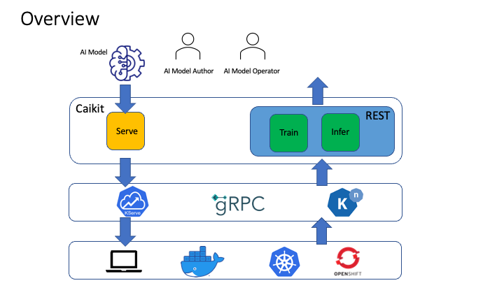

# Caikit

Caikit is an AI toolkit that enables users to manage AI models through a set of developer friendly APIs. It provides a consistent format for AI model deployment, consumption and evolution.



## Capabilities

Caikit streamlines the management of AI models for application usage. Think of it as REST API for applications to AI models.

- Hosts AI models for inference and training so that models can be accessed through APIs
- Provides access to the different training techniques as supported by a model
- Supports models from different AI communities like HuggingFace ...
- Allows applications to change model versions without any code changes
- Compatability with other AI model runtimes

## What Differentiates Caikit to Other AI Model Runtimes?

Developers who write applications that consume AI models are not necessarily AI experts who understand the intricate details of the AI model that they use. Some would like to treat it as a "black box" where they give it input and it returns the output. This is similar in cloud computing whereby some users would like to deploy their applications to the cloud without detailed knowledge of the cloud infrastructure. The value for them is in their application and that is what is of most interest to them.

Caikit provides an abstraction layer for application developers where they can consume an AI model through APIs independent of understanding the data form of the model. In other words, the input and output to the model is in a format which is easily programmable and does not require data transformations. This facilitates the model and the application to evolve independently of each other.

Does this matter when you just want to load 1 or 2 models? No. The benefits are when consuming 10s or hundreds of AI model. Caikit simplifies the scaling and maintainence of such integrations compared to other runtimes. This is because other runtimes require an AI centric view of the model (for example, the common interface of “tensor in, tensor out”) which means having to code different data tranformations into the application for each model. Additionally, the data form of the model may change from version to version.

## User Profiles

There are 2 user profiles who leverage Caikit:

- AI Model Author:
  - Model Authors build and train AI models for data analysis
  - They bring data and tuning params to a pre-existing model and creates a new model using APIs provided by Caikit
  - Examples of model authors are machine learning engineers, data scientists, and AI developers
- AI Model Operator:
  - Model operators request analysis of a data set by operating on it with a trained AI model (Inference)
  - They take trained models, deploy them, and then infer the models in applications through APIs provided by Caikit
  - Examples of operators are application developers, and AI model authors

## Quick Start

**TODO: Need to redesign this section**

<strike>

### Prerequisitive

Install Caikit toolkit:

```console
pip install caikit
pip install caikit-nlp

# TODO: import the libraries to enable the sample code to run
```

### Preprocessing

Start by loading training data from Consumer Financial complaint database:

**TODO: show how to preprocess sample training data**

```python

```

### Training

Train an TF-IDF SVM classifier model on the training data:

```python
import caikit_nlp

syntax_model = caikit.load('syntax_izumo_en_stock'))

tfidf_classification_model = caikit_nlp.workflows.classification.base_classifier.tfidf_svm.TFidfSvm.train(
    training_data=training_data,
    syntax_model=syntax_model, 
    tfidf_svm_epochs=1,
    multi_label=True
)
```

### Inference

Use the trained model for prediction on new data:

```python
tfidf_svm_preds = tfidf_classification_model.run(text)
```

## Start the runtime with the sample_lib! 

Useful for interacting with the runtime with the sample_lib and playing around with it.

### Start the server
In one terminal, run the script that starts the server:

```
python3 -m examples.start_runtime_with_sample_lib
```

### Start training a sample block

This script will also create `protos`. In order to interact with the `sample_lib`, in another terminal, go inside that directory:

```
cd protos
```
then

```
grpcurl -plaintext -proto samplelibtrainingservice.proto -d '{"model_name": "my_model", "training_data": {"file": {"filename": "protos/sample.json"}}}' localhost:8085 caikit.runtime.SampleLib.SampleLibTrainingService/BlocksSampleTaskSampleBlockTrain
```
### Fetch status through training management API

```
grpcurl -plaintext -proto trainingmanagement.proto -d '{
    "training_id": "<training_id_from_above_response>"
}' localhost:8085 caikit.runtime.training.TrainingManagement/GetTrainingStatus
```
### Run prediction on trained block
```
grpcurl -plaintext -proto samplelibservice.proto -d '{"sample_input": {"name": "blah"}}' -H 'mm-model-id: my_model' localhost:8085 caikit.runtime.SampleLib.SampleLibService/SampleTaskPredict
```

</strike>

## Code of conduct

Participation in the Caikit community is governed by the [Code of Conduct](CODE-OF-CONDUCT.md).
