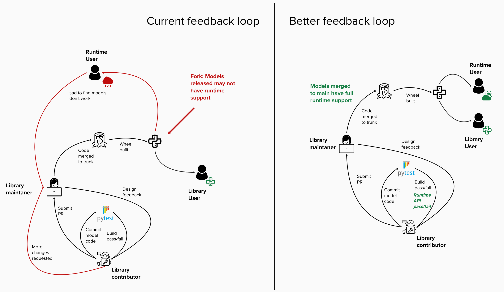

# Cake POP 001 - Better encoding of domain and task constraints

Welcome to the first Caikit Proposal of Progress (CakePOP!)


## Abstract

This CakePOP defines a specification for how AI Domains and Tasks are defined, with new type decorators for each. Making explicit definitions for tasks and domains encodes the knowledge from our many [ADRs](), and resolves much of the confusing user experience around the implicit assumption of task and domain based on project structure.

This CakePOP also proposes api validation rules to be applied to user code at decoration time to tighten the development feedback loop, and proposes a new module type to clear up the confusing semantics of validating a block for public vs. internal use.

## Goals

The scope of this cakepop covers the mechanisms for users to:
- Define an AI Domain
- Define an AI Task
- Link a module to an AI Task
- Validate module code for type correctness
- Introduce the coupler module

## Non Goals

- Suggesting any ordinality between caikit project and number of domains / tasks
- Saying anything about re-use of existing domain and tasks vs. redeclaring new ones
- Discussing any opinions about which tasks should exist in a domain

## Motivation

Currently, AI tasks and domains are defined implicitly by caikit project structure where:
- The AI domain is the name of the project
- The task is defined by the enclosing directory of a set of modules

This has a few problems
- It’s not documented (or at least not very well)
- One single project may want to span multiple AI domains
- A document processing project may author CV models to convert images to docs, DU models to extract information from rich text elements, and NLP models to analyze the text
- Any requirements on user project structure inhibit authors from designing their code how they want, and may be incompatible with other frameworks an author is using
- Caikit-side validation code has to logic through these implicit definitions to try to bucket models into tasks and domains, which is more complex and error prone than relying on explicit definitions
- Nefarious edge cases abound: If a project has a task directory with multiple well-defined models, a contributor that adds one ill-defined model to that directory would end up bricking runtime support for the entire task.
- Task validation is only run when a runtime is generated. This potentially causes a feedback loop where problematic module definitions aren’t caught until after code is merged in and released



The point of caikit was to define AI tasks where models that implement the task can be seamlessly swapped out for one another without requiring updates to client code.
This is a boon for MLOps but requires the stability of both input and output types.
Currently, `caikit` has neither:
- Validation on the input or output of models against the domain or task, nor
- An abstraction for a model which does not take domain input but rather operates on the output of another task to complete its own task

## Rationale

Why these changes at all?

- The templates for creating a caikit project are intense
- Debugging what is wrong with a module interface when it is not available in the runtime is a tedious slog, according to users
- Modules have been contributed to projects that don't fit the task they are slotted into, and it falls on the project maintainers to catch this in code review which is also tedious 

Why classes + class decorators for tasks and domains?

The core caikit APIs are provided as class decorators and are invoked at import time, to help model authors create well-typed AI packages.
While the base classes and decorator-injected code provide reasonable defaults, the author has complete control to override any methods on the resulting class that they choose.
It should be possible for users to tweak the behavior of their domain and task where necessary.

Why couplers?

It is hard to communicate that, for a given task, 
- some blocks operate on the domain input and others do not
- only blocks that operate on the domain input can be freely swapped using the same runtime api
- blocks operating instead on other tasks' outputs are meant to be chained together with blocks of the first task instead

Any future work to allow dynamic instantiation of "workflows" or "pipelines" that chain models together would be hard to statically validate with the current ambiguity on model input types.
Couplers that explicitly connect tasks together would be easy to compose into pipelines in a validated way.

## Terminology

**AI Domain**: A grouping of tasks that operate on a common domain model. 

**AI Task**: The “abstract interface” of a model within a domain. A task defines an input type and output type that models completing this task must adhere to. Models of the same task should be interchangeable with no changes to client code, to meet differing hardware, performance, quality, latency, cost, or other requirements. Examples might include:

    NLP.Summarization: text → text
    NLP.Classification: text → class (spam detection, …?)
    NLP.Vectorization: text → embedding vector
    CV.ObjectDetection: image → bounding box (facial recognition, table-tennis ball tracking)

**Block**: An implementation of a module that completes a task. Specifically, this model takes input from the domain model.

An example is an implementation of an `NLP.Classifier` that takes text as input and outputs a classification

**Coupler**: An implementation of a module that partially completes a task. This model takes input from the output of another task in the domain.

An example is an implementation of an `NLP.Classifier` that takes an embedding vector as input (the output of an NLP.Vectorizer) and outputs a classification

**CV**: The Computer Vision domain, which operates on images and video.

**NLP**: The Natural Language Processing domain, which operates on raw text

## Specification

Changes to existing types/apis:

modules now:
- must have a `task` defined, set in the module decorator
- will hold their own `CaikitSignature` objects with the introsepcted bits of the relevant functions (e.g. run, train)

blocks now:
- will validate the output type of the `run` signature against the block’s task, and raise if it does not match
- will validate the input parameters of the `run` signature against the block’s domain

This decorator will raise because run has no parameters in the domain:

```python
@caikit.block(id=some_guid, task=caikit.interfaces.nlp.Sentiment, …)
class MySentimentBlock:
    def run(embeddings: caikit.interfaces.nlp.Embedding) → caikit.interfaces.nlp.Sentiment:    pass
```

This decorator will raise because run has the incorrect output type:

```python
@caikit.block(id=some_guid, task=caikit.interfaces.nlp.Sentiment, …)
class MySentimentBlock:
    def run(raw_document: caikit.interfaces.nlp.RawDocument) → pandas.DataFrame:    pass
```

New types/apis:

`@caikit.domain` a new class decorator will operate on classes that extend `caikit.DomainBase`
It must specify a set of parameters (name + type pairs) that define the input domain model.
All `blocks` in the domain must take at least one of these parameters as input

```python
@caikit.domain({
    “raw_document”: caikit.interfaces.nlp.RawDocument
})
class NLP(caikit.DomainBase):
    pass
```

A new class DomainBase will provide a `validate_parameters` method which will raise if the `CaikitSignature` does not have at least one parameter from the domain.

`@caikit.task` a new class decorator will operate on classes that extend `caikit.TaskBase`.
It must specify a domain the task is part of.
It must specify a data model output type that all modules of this task must output.
```python
@caikit.task(
    domain=caikit.interfaces.nlp.NLP,
    output_type=caikit.interfaces.nlp.SentimentPrediction
)
class Sentiment(caikit.TaskBase):
    pass
```

A new class TaskBase will provide a `validate_output` method which will raise if the `CaikitSignature` does return the correct type for the task.

A new coupler module type will allow authors to define modules that couple the output of one task to the output of another.
The following coupler is valid:
```python
@caikit.coupler(id=some_guid, task=caikit.interfaces.nlp.Sentiment, input_task=caikit.interfaces.nlp.Vectorize, …)
def MySentimentCoupler:
    def run(embeddings=caikit.interfaces.nlp.Embeddings) → caikit.interfaces.nlp.SentimentPrediction:
        pass
```
couplers are not included in the remote runtime interfaces.

## Backwards Compatibility

Backwards compatibility for the `@block` decorator to not specify the `task` parameter should not be provided.
This would result in maintaining the current logic for deducing a block’s task implicitly which is already very flaky, and would only be worse if users were allowed to mix explicit task declarations with implicit ones.
It is a very small change for users to hoist their definition of a `task` and add the parameter to each `@block` declaration.

Backwards compatibility to allow the `@block` decorator to not run input validation should be supported.
While we want users to have access to a tight development feedback loop, we also don’t want to brick existing builds where users may have a large delta to overcome to make their blocks fit their tasks, and convert existing blocks to couplers where necessary.

